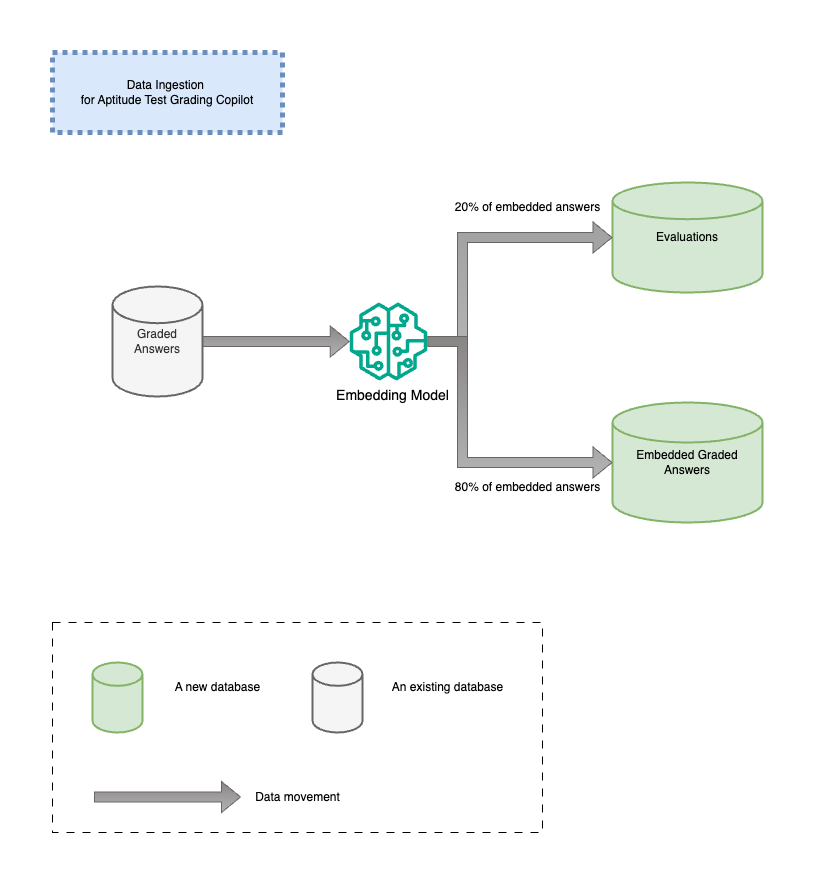

# Data Ingestion for grading assistant

## The ingestion process

Pick an embedding model to encode 80% graded answer with its grade and save it *by grade* into a new vector database, embedded_graded_answers.

Save the rest of 20% of graded answers with their grades into another database, evaluations, for inference evaluation purposes.
