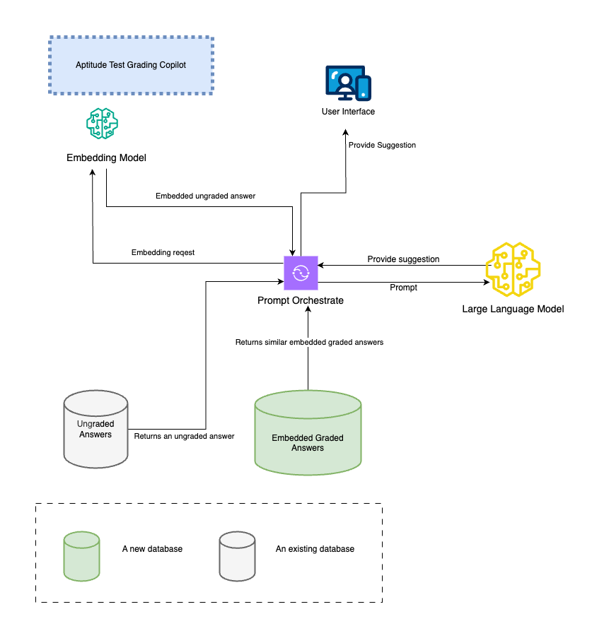

# Grading Assistant

## Aptitude Manual Grader Assistant



For a given ungraded answer, the assistant

first use the same embedding model to encode the answer

second use the encoded answer to perform a similarity search in the vector db to retrieve
similar answers

third constuct the prompt using the ungraded answer, graded answers with their grades

fourth send the prompt to the LLM

fifth parse the response and display to the user

### Prompt template

```text
<context></context>
<ungraded-answer></ungraded-answer>
<graded-answers></graded-answers>

I am a system architect grading short answers for a certification exam.
Use {graded-answers} as references to grade this {ungraded-answer}. 
Give me grades in terms of clarity, logical flow, and accuracy. Use these
three criteria and suggest a final grade.
```

## Architecture Manual Grader Assistant

For case studies, the chance of prompt overflow is higher. Additional techniques are required to solve this problem. One possible solution is to include an additional summarization step. In the summarization step, we only send the case study answers to the LLM. This includes the ungraded case study as well as similar graded case studies.
