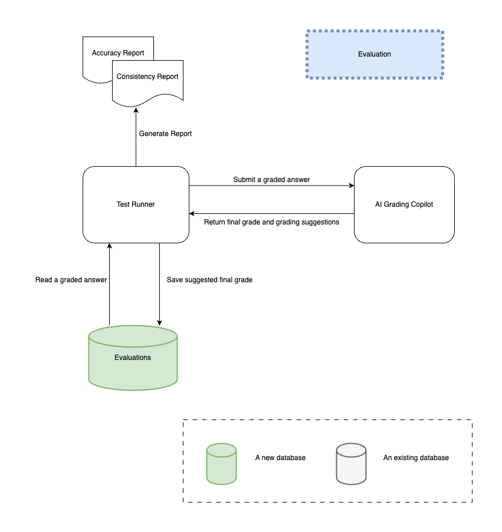

# Evaluations

## Guaging Accuracy

Select a graded answer from the evaluations database, run it through the assistant,
and compare the suggested final grade with the actual grade.

Perform this exercise 100 times, and calculate the level of accuracy.

## Improving Accuracy

One way to improve accuracy is to use the method above to evaluate different LLMs,
 and see which LLM produces the highest accuracy.

Another way is to tweak the prompt to improve accuracy.

A third way is by enriching the data stored as graded answers. If currently, Certifiable
is not storing the metrics that drive the final grading, such as clarity, logic, and accuracy,
it's desirable to gather these metrics from the graders. With the enriched data, we could
prompt the LLMs to provide scores in each category and it's explanation in addition to
the final score. The breaking down of the final score by the LLM into categorical score along side
its explanation may be additional context that can in turn be valuable for the graders.

## Gauging Consistency

For a given model, run the ai assistant 10 times for the same ungraded answer and observe the proposed final grade and the intermediate grades.

## Improving Consistency

Modifying the prompt could yield better consistency.
